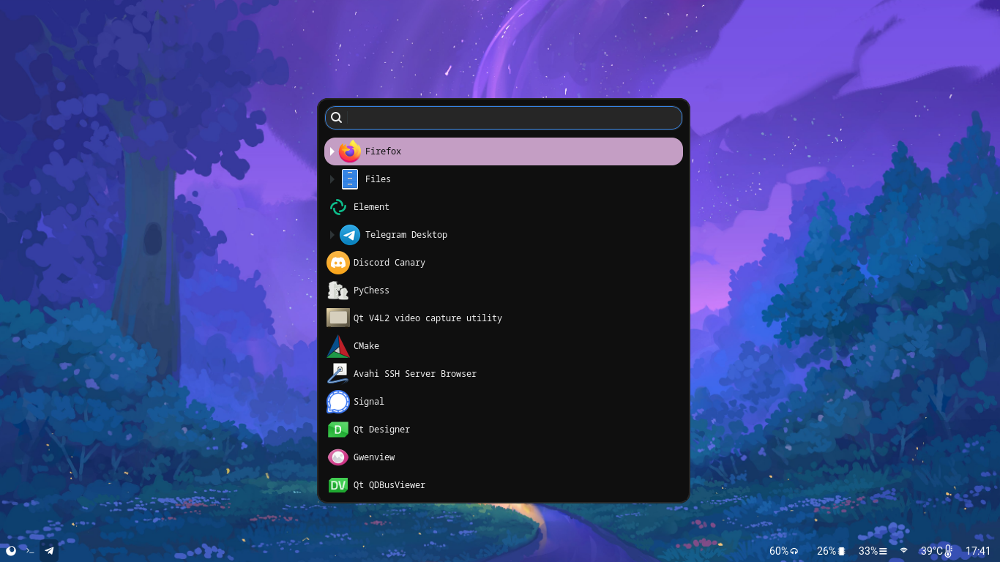
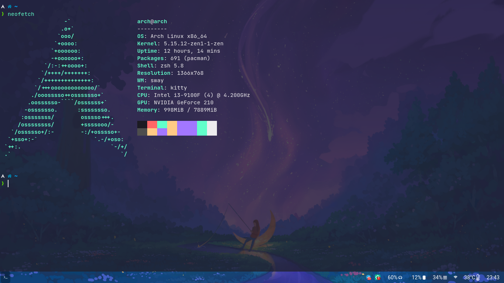
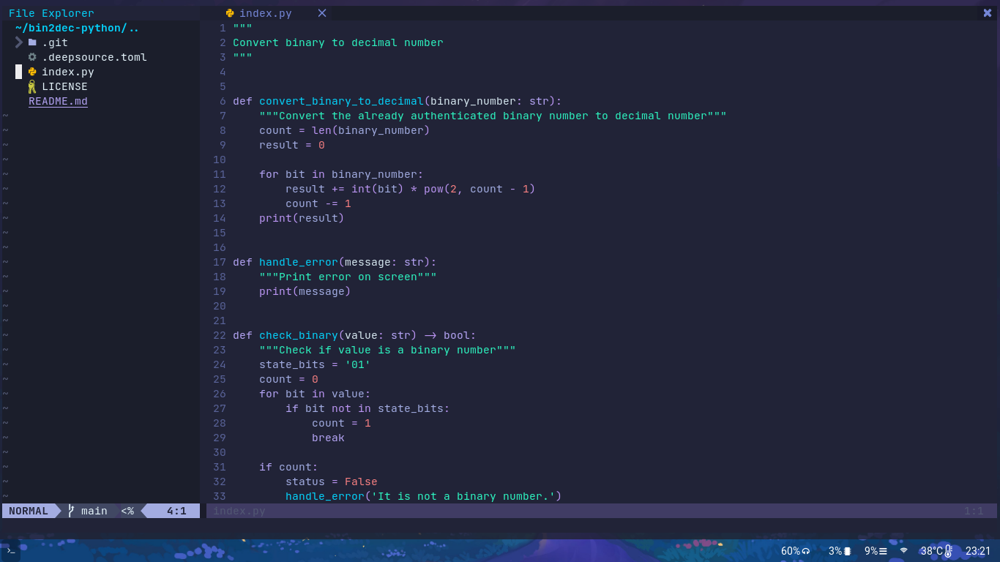

# Dotfiles
[](https://github.com/victor4pinheiro/dotfiles/blob/main/LICENSE)
[](https://www.linkedin.com/in/victor-4-pinheiro)

Welcome to my dotfiles repo. Below you'll find  a list of my dotfiles, including neovim, sway and waybar.

If you're new to sway and Wayland, you need to install alternatives for your programs to be compatible with Wayland, see this [guide](https://github.com/swaywm/sway/wiki/i3-Migration-Guide#common-x11-apps-used-on-i3-with-wayland-alternatives)

Versions difference:

* v0.1.0:
    * Using dmenu and Xwayland;
* v0.2.0:
    * Using wofi and removed xwayland;
* v0.3.0:
    * For neovim, change to packer.nvim to manage plugins and separating each section in their each file (shortcuts, plugins and config);
    * Not using kitty anymore. Currently using foot;
    * Some icons on waybar changed: Using font-awesome icons.

# Summary
* [Getting Start](#start)
  * [Prerequisites](#prerequisites)
    * [Fonts](#fonts)
    * [UI Components](#ui)
    * [Programs](#programs)
* [Wallpaper](#wallpaper)
* [Screenshots](#screenshot)
* [How to use](#how-to-use)
  * [Foot (Foo terminal)](#foot)
  * [Neovim](#neovim)
    * [List of plugins](#list-of-plugins)
  * [Sway + Waybar](#sway)
  * [For Arch users](#arch-users)
* [Issues](#issues)
* [License](#license)

<a name="start"></a>
# :bulb: Getting Start

<a name="prerequisites"></a>
## Prerequisites

<a name="fonts"></a>
### Fonts

* [JetBrains Mono](https://git-scm.com/)
* [Nerd Fonts](https://github.com/ryanoasis/nerd-fonts) (optional)
* [Font Awesome](https://fontawesome.com/) - Recommended version >= 5
* [Roboto](https://fonts.google.com/specimen/Roboto)

<a name="ui"></a>
### UI Components

* Window manager: [SwayWM](https://swaywm.org/)
* Status bar: [Waybar](https://github.com/Alexays/Waybar)
* Application launcher: [wofi](https://hg.sr.ht/~scoopta/wofi)

<a name="programs"></a>
### Programs

* Protocol: [Wayland](https://wayland.freedesktop.org/) for Sway (in Arch, sway will automatically install wayland)
* Version manager: [Git](https://git-scm.com/)
* Terminal: [Foot](https://codeberg.org/dnkl/foot)
* Editor: [Neovim](https://neovim.io/) >= 0.6.0
* Audio: [Pipewire](https://pipewire.org/) with pipewire-pulse

<a name="wallpaper"></a>
# Wallpaper


<a href="https://www.peakpx.com/en/hd-wallpaper-desktop-kfgcv">Download</a>

<a name="screenshot"></a>
# Screenshots

<h3>System with notifications</h3>


<h3>System with wofi</h3>



<h3>Foot (Terminal)</h3>



<h3>Neovim (editor)</h3>



<a name="how-to-use"></a>
# How to use

Firstly, clone the files in your home directory:
```
git clone https://github.com/victor4pinheiro/dotfiles $HOME/
```

<a name="foot"></a>
## Foot (Foo terminal)

Copy the folder
```
cp -r $HOME/dotfiles/foot $HOME/.config/
```
In previous version, I used to kitty as my default terminal, but I searched for a lightweight alternative and so I found foot.

I think it is more lightweight, easy to customize and totally made for Wayland.

<a name="neovim"></a>
## Neovim

This is more complex to do, so you will need:
1. Install neovim (version >= v0.6.0)
2. Create nvim directory inside $HOME/.config
```
mkdir -p $HOME/.config/nvim
```
3. Install a plugin manager (vim-plug, pathogen, packer.nvim etc). In this dotfile, I use packer.nvim, so acess the [Packer](https://github.com/wbthomason/packer.nvim) and follow the instructions.
4. Now, copy the neovim config to nvim directory:
```
cp -r $HOME/dotfiles/init.lua $HOME/.config/nvim/
```
5. Enter neovim by typing nvim on terminal
```
nvim
```
6. Now install all the plugins:
```
:PackerInstall
```
7. Source the init.lua:
```
:luafile %
or
:source %
```
If you don't see any changes, exit neovim and open again. With this, you'll see neovim working right.

WARNING: No LSP and no parser is installed by default so you need to install them using [treesitter-nvim](https://github.com/nvim-treesitter/nvim-treesitter) and [nvim-lsp-installer](https://github.com/williamboman/nvim-lsp-installer).

<a name="list-of-plugins"></a>
#### List of plugins

Startup:

* lewis6991/impatient.nvim.

Plugin manager:

* wbthomason/packer.nvim.

Language Server Protocol

* neovim/nvim-lspconfig;
* williamboman/nvim-lsp-installer.

Language Parser:

* nvim-treesitter/nvim-treesitter.

Rainbow brackets:

* terrortylor/nvim-comment.

File explorer:

* kyazdani42/nvim-tree.lua;
* kyazdani42/nvim-web-devicons.

Fuzzy file finder:

* nvim-telescope/telescope-fzf-native.nvim;
* nvim-telescope/telescope.nvim;
* nvim-lua/plenary.nvim.

Completions and snippets:

* onsails/lspkind-nvim;
* hrsh7th/cmp-nvim-lsp;
* hrsh7th/cmp-buffer;
* hrsh7th/cmp-path;
* hrsh7th/cmp-cmdline;
* hrsh7th/nvim-cmp;
* hrsh7th/cmp-calc;
* hrsh7th/cmp-nvim-lsp-signature-help;
* L3MON4D3/LuaSnip;
* saadparwaiz1/cmp_luasnip.

Auto-Pair closing brackets:

* windwp/nvim-autopairs.

Git:

* lewis6991/gitsigns.nvim.

Status and bufferline

* nvim-lualine/lualine.nvim;
* akinsho/bufferline.nvim.

Terminal

* akinsho/toggleterm.nvim

Theme

* getomni/neovim

Scroll

* karb94/neoscroll.nvim

Move lines

* booperlv/nvim-gomove

Colorizer

* norcalli/nvim-colorizer.lua

<a name="sway"></a>
## Sway + Waybar

Copy the config file of sway
```
cp -r $HOME/dotfiles/sway $HOME/.config/
```
Now copy the config directory of waybar
```
cp -r $HOME/dotfiles/waybar $HOME/.config/
```
With this, just press Super + Shift + C and you'll see changes.

<a name="arch-users"></a>
## For Arch users (BTW I use arch :rofl:)

I don't recommend my config without see the [wiki](https://wiki.archlinux.org/), but if you already know what [pacman.conf](https://wiki.archlinux.org/title/pacman) and [makepkg.conf](https://wiki.archlinux.org/title/makepkg) do, so just copy config file:

WARNING: I use doas to use use root privileges, so just change to command root you installed
Firstly the pacman:
```
doas cp -r $HOME/dotfiles/pacman.conf /etc/pacman.conf
```
Makepkg:
```
doas cp -r $HOME/dotfiles/makepkg.conf /etc/makepkg.conf
```
<a name="issues"></a>
# Issues

Feel free to file a new issue with a respective title and description.

<a name="license"></a>
# License

This project is under the MIT license. See the LICENSE for details.

[LICENSE](LICENSE)

Made with :heart: by [Victor Pinheiro](https://www.linkedin.com/in/victor-4-pinheiro/)
