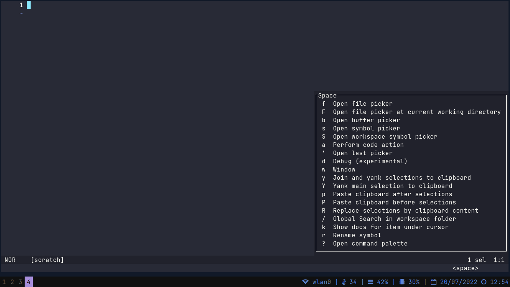

# Dotfiles
[](https://github.com/victor4pinheiro/dotfiles/blob/main/LICENSE)
[](https://www.linkedin.com/in/victor-4-pinheiro)

Welcome to my dotfiles repo. Below you'll find  a list of my dotfiles, including neovim, sway and waybar.

If you're new to sway and Wayland, you need to install alternatives for your programs to be compatible with Wayland, see this [guide](https://github.com/swaywm/sway/wiki/i3-Migration-Guide#common-x11-apps-used-on-i3-with-wayland-alternatives)

# Changelog

* v0.1.0:
    * Using dmenu and Xwayland;
* v0.2.0:
    * Using wofi and removed xwayland;
* v0.3.0:
    * For neovim, change to packer.nvim to manage plugins and separating each section in their each file (shortcuts, plugins and config);
    * Not using kitty anymore. Currently using foot;
    * Some icons on waybar changed: Using font-awesome icons.
* v0.4.0:
    * Testing [helix](https://helix-editor.com/);
    * Remove wallpaper (too much heavy);
    * Change waybar to swaybar (waybar too slow on boot)
    * Change wofi to bemenu-wayland

# Summary
* [Getting Start](#start)
  * [Prerequisites](#prerequisites)
    * [Fonts](#fonts)
    * [UI Components](#ui)
    * [Programs](#programs)
* [Screenshots](#screenshot)
* [How to use](#how-to-use)
  * [Foot (Foo terminal)](#foot)
  * [Helix](#helix)
  * [Sway + Swaybar](#sway)
  * [For Arch users](#arch-users)
* [Issues](#issues)
* [License](#license)

<a name="start"></a>
# :bulb: Getting Start

<a name="prerequisites"></a>
## Prerequisites

<a name="fonts"></a>
### Fonts

* [JetBrains Mono](https://git-scm.com/)
* [Nerd Fonts](https://github.com/ryanoasis/nerd-fonts) (optional)
* [Roboto](https://fonts.google.com/specimen/Roboto)
* [Awesome terminal fonts](https://github.com/gabrielelana/awesome-terminal-fonts)

<a name="ui"></a>
### UI Components

* Window manager: [SwayWM](https://swaywm.org/)
* Status bar: [Swaybar](https://swaywm.org/)
* Application launcher: [bemenu](https://github.com/Cloudef/bemenu)

<a name="programs"></a>
### Programs

* Protocol: [Wayland](https://wayland.freedesktop.org/) for Sway (in Arch, sway will automatically install wayland)
* Version manager: [Git](https://git-scm.com/)
* Terminal: [Foot](https://codeberg.org/dnkl/foot)
* Editor: [Helix](https://helix-editor.com/)
* Audio: [Pipewire](https://pipewire.org/) with pipewire-pulse

<a name="screenshot"></a>
# Screenshots

<h3>Background</h3>


<h3>System with wofi</h3>


<h3>Foot (Terminal)</h3>


<h3>Helix-editor</h3>



<a name="how-to-use"></a>
# How to use

Firstly, clone the files in your home directory:
```
git clone https://github.com/victor4pinheiro/dotfiles $HOME/
```

<a name="foot"></a>
## Foot (Foo terminal)

Copy the folder
```
cp -r $HOME/dotfiles/foot $HOME/.config/
```
In previous version, I used to kitty as my default terminal, but I searched for a lightweight alternative and so I found foot.

I think it is more lightweight, easy to customize and totally made for Wayland.

<a name="helix"></a>
## Helix

Now this is more easy to do. Just install the package from official repositories or compile it.

<a name="sway"></a>
## Sway + Swaybar

Copy the config file of sway
```
cp -r $HOME/dotfiles/sway $HOME/.config/
```

With this, just press Super + Shift + C and you'll see changes.

<a name="arch-users"></a>
## For Arch users (BTW I use arch :rofl:)

I don't recommend my config without see the [wiki](https://wiki.archlinux.org/), but if you already know what [pacman.conf](https://wiki.archlinux.org/title/pacman) and [makepkg.conf](https://wiki.archlinux.org/title/makepkg) do, so just copy config file:

WARNING: I use doas to use use root privileges, so just change to command root you installed
Firstly the pacman:
```
doas cp -r $HOME/dotfiles/pacman.conf /etc/pacman.conf
```
Makepkg:
```
doas cp -r $HOME/dotfiles/makepkg.conf /etc/makepkg.conf
```
<a name="issues"></a>
# Issues

Feel free to file a new issue with a respective title and description.

<a name="license"></a>
# License

This project is under the MIT license. See the LICENSE for details.

[LICENSE](LICENSE)

Made with :heart: by [Victor Pinheiro](https://www.linkedin.com/in/victor-4-pinheiro/)
